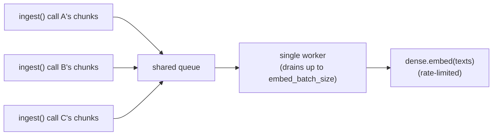

# Batching

`IngestProcessor` routes every dense-embedding call through an `EmbeddingBatchCoordinator` internally — you don't construct one directly in normal use. This page documents it for advanced use (custom queues, monitoring, or using the coordinator standalone outside `IngestProcessor`).

## Why this exists

When multiple coroutines call `ingest()` concurrently on the *same* `IngestProcessor` instance — e.g. several articles being ingested in parallel — each call used to send its own `embed_batch_size`-sized batches straight at the dense provider, independently of every other concurrent call. Under a rate-limited provider (`SlidingWindowStrategy`/`GeminiDenseProvider`), that means concurrent callers collide on the same per-minute budget with no coordination between them, and a caller with an unusually large amount of text (many more chunks than `embed_batch_size`) can end up needing several batches while other concurrent callers' batches interleave — wasting rate-limit budget on avoidable contention.

`EmbeddingBatchCoordinator` fixes this by funneling every concurrent caller's chunks through **one shared queue** drained by **one background worker**, which composes each real provider call from whatever's currently queued — potentially mixing chunks from several concurrent `ingest()` calls into a single batch — instead of each caller dispatching independently.



One worker by default — not one-per-caller — because the rate limit is a single shared resource regardless of worker count; a single worker avoids wasted collisions by construction rather than merely reducing their frequency.

## Single-caller behavior is unchanged

If your application never has two `ingest()` calls in flight at once on the same processor, the coordinator is invisible — you get the same effective sequential `embed_batch_size`-sized batching as calling the provider directly, just routed through one extra queue/future hop.

## Configuring it via `IngestProcessor`

```python
processor.configure(
    backend=backend,
    dense=dense_provider,
    embed_batch_size=32,       # max chunks per real provider call
    embed_queue_factory=None,  # optional — see "Custom queues" below
)
```

`embed_batch_size` here is the same parameter `IngestProcessor.configure()` always had — it now governs the coordinator's batch size rather than a per-call sequential loop's.

## Custom queues

`queue_factory` (on `EmbeddingBatchCoordinator`) / `embed_queue_factory` (on `IngestProcessor.configure()`) is a dependency-inversion seam: pass a zero-argument callable returning any `asyncio.Queue`-compatible object (a subclass with custom `put`/`get`/`get_nowait` behavior — priority ordering, instrumentation, a bounded size, etc.). Not specifying one produces a plain FIFO `asyncio.Queue()`, built lazily on first use so it always binds to the event loop actually running at the time — never at `configure()` time.

```python
import asyncio

def instrumented_queue_factory() -> asyncio.Queue:
    queue = asyncio.Queue()
    # wrap put()/get() here for tracing, or return a PriorityQueue, etc.
    return queue

processor.configure(
    backend=backend,
    dense=dense_provider,
    embed_queue_factory=instrumented_queue_factory,
)
```

`get_embed_queue()` / `set_embed_queue()` (and the coordinator's own `get_queue()` / `set_queue()`) exist mainly for observability and test seams — e.g. checking `queue.qsize()` for backlog monitoring — not as a routine runtime-reconfiguration API. `set_queue()`/`set_embed_queue()` is non-trivial to use correctly:

!!! warning "Swapping the queue while ingestion is in flight"
    `set_queue()` migrates every item still *sitting* in the current queue onto the new one, then stops and restarts the worker. The item(s) the worker had **already claimed and was actively calling `dense.embed()` for** are not migrated — that in-flight call is cancelled along with the worker, and the corresponding `ingest()`/`embed_many()` caller receives `asyncio.CancelledError` instead of a result. Call `set_queue()`/`set_embed_queue()` between runs, not while `ingest()` calls are still in flight, to avoid losing that in-flight work.

## API Reference

::: chatbot_plugin_sdk.batching.EmbeddingBatchCoordinator
    options:
      members:
        - __init__
        - embed_many
        - aclose
        - get_queue
        - set_queue

::: chatbot_plugin_sdk.batching.EmbedWorkItem
